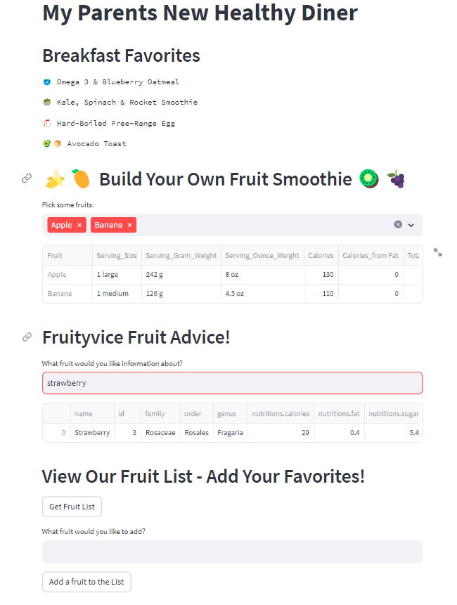

# My Parents New Healthy Diner

#### Introduction:
As part of the "Hands On Essentials - Data Applications" course, I've created an engaging Streamlit application called "My Parents New Healthy Diner." This interactive app lets users explore and customize breakfast favorites in a fun way.

#### Project Scope:

This project showcases the practical application of course concepts and creates an engaging user experience centered around healthy breakfast options:
<ul>
<li>Customization: Users can create unique fruit smoothies by selecting ingredients, supported by a user-friendly search feature.</li>
<li>Fruityvice Fruit Advice: The app includes a dedicated section that offers in-depth information about a variety of fruits.</li>
<li>User Engagement: Users are encouraged to contribute by adding their favorite fruits to the app's list, promoting a sense of community involvement.</li>
</ul>

By combining these features, the project not only demonstrates the acquired knowledge but also offers a valuable tool for exploring and embracing a health-conscious breakfast routine.

<a href="https://rvabonita-first-streamlit-app-streamlit-app-zmdb69.streamlit.app/"></img></a>
